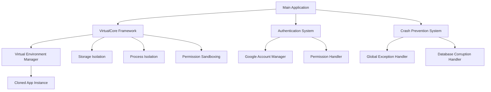

# 🚀 App Cloning System Implementation Guide (বাংলা)

## 📋 সূচিপত্র
1. [সিস্টেম আর্কিটেকচার ওভারভিউ](#system-architecture)
2. [VirtualCore Framework ব্যাখ্যা](#virtualcore-framework)
3. [নতুন Feature Implementation গাইড](#new-feature-implementation)
4. [App Stability বজায় রাখার Best Practices](#stability-best-practices)
5. [Code Structure এবং Naming Conventions](#code-structure)
6. [Testing এবং Debugging Strategies](#testing-debugging)
7. [Practical Implementation Examples](#practical-examples)

---

## 🏗️ System Architecture Overview {#system-architecture}

### মূল Components:



### কীভাবে কাজ করে:

1. **Main Application Layer**: মূল অ্যাপ্লিকেশন যা user interface এবং navigation handle করে
2. **VirtualCore Framework**: Virtual environment তৈরি করে প্রতিটি cloned app এর জন্য
3. **Authentication System**: Google Account login এবং permission management
4. **Crash Prevention**: Global error handling এবং stability maintenance

---

## ⚙️ VirtualCore Framework Explanation {#virtualcore-framework}

### VirtualCore কী?

VirtualCore হলো একটি powerful framework যা Android এ virtual environment তৈরি করে। এটি একটি app এর মধ্যে অন্য app চালানোর সুবিধা দেয়।

### মূল Features:

#### 1. **Process Isolation**
```java
// VirtualCore initialization
public class VaManager {
    public static void oOO00OO0Oo0() {
        VirtualCore.get().initialize(new VirtualCore.VirtualInitializer() {
            @Override
            public void onMainProcess() {
                // Main process initialization
            }
            
            @Override
            public void onVirtualProcess() {
                // Virtual process initialization
            }
        });
    }
}
```

#### 2. **Storage Sandboxing**
- প্রতিটি virtual app এর আলাদা file system
- Data isolation এবং security
- Independent permission management

#### 3. **Authentication Isolation**
- প্রতিটি cloned app এর জন্য আলাদা account
- Independent login sessions
- Secure token management

---

## 🔧 New Feature Implementation Guide {#new-feature-implementation}

### Step 1: Requirement Analysis

```kotlin
// Feature planning template
data class FeatureRequirement(
    val featureName: String,
    val targetApps: List<String>,
    val permissions: List<String>,
    val dependencies: List<String>,
    val riskLevel: RiskLevel
)

enum class RiskLevel {
    LOW,    // UI changes only
    MEDIUM, // Business logic changes
    HIGH    // Core system changes
}
```

### Step 2: Architecture Design

#### MVVM + Clean Architecture Pattern:

```kotlin
// 1. Data Layer
interface FeatureRepository {
    suspend fun getFeatureData(): Result<FeatureData>
    suspend fun saveFeatureData(data: FeatureData): Result<Unit>
}

// 2. Domain Layer
class FeatureUseCase(
    private val repository: FeatureRepository
) {
    suspend fun executeFeature(): Result<FeatureResult> {
        return try {
            val data = repository.getFeatureData().getOrThrow()
            // Business logic here
            Result.success(FeatureResult(data))
        } catch (e: Exception) {
            Result.failure(e)
        }
    }
}

// 3. UI Layer
class FeatureViewModel(
    private val useCase: FeatureUseCase
) : ViewModel() {
    
    private val _uiState = MutableLiveData<FeatureUiState>()
    val uiState: LiveData<FeatureUiState> = _uiState
    
    fun loadFeature() {
        viewModelScope.launch {
            _uiState.value = FeatureUiState.Loading
            
            useCase.executeFeature()
                .onSuccess { result ->
                    _uiState.value = FeatureUiState.Success(result)
                }
                .onFailure { error ->
                    _uiState.value = FeatureUiState.Error(error.message)
                }
        }
    }
}
```

### Step 3: VirtualCore Integration

```kotlin
// Virtual environment এ feature add করা
class VirtualFeatureManager {
    
    fun installFeatureInVirtualApp(
        packageName: String,
        featureConfig: FeatureConfig
    ): Boolean {
        return try {
            // 1. Virtual app check
            val virtualApp = VirtualCore.get().findApp(packageName)
                ?: throw IllegalStateException("Virtual app not found")
            
            // 2. Permission validation
            validatePermissions(featureConfig.requiredPermissions)
            
            // 3. Feature installation
            installFeatureComponents(virtualApp, featureConfig)
            
            // 4. Update virtual app configuration
            updateVirtualAppConfig(packageName, featureConfig)
            
            true
        } catch (e: Exception) {
            Log.e(TAG, "Feature installation failed", e)
            false
        }
    }
    
    private fun validatePermissions(permissions: List<String>) {
        permissions.forEach { permission ->
            if (!hasPermission(permission)) {
                throw SecurityException("Permission not granted: $permission")
            }
        }
    }
}
```

### Step 4: Error Handling Implementation

```kotlin
// Comprehensive error handling
class SafeFeatureExecutor {
    
    suspend fun <T> executeWithSafety(
        operation: suspend () -> T
    ): Result<T> {
        return try {
            // Pre-execution validation
            validateSystemState()
            
            // Execute with timeout
            withTimeout(30_000) {
                Result.success(operation())
            }
        } catch (e: TimeoutCancellationException) {
            Log.e(TAG, "Operation timeout", e)
            Result.failure(FeatureTimeoutException("Operation took too long"))
        } catch (e: SecurityException) {
            Log.e(TAG, "Security violation", e)
            Result.failure(FeatureSecurityException("Permission denied"))
        } catch (e: Exception) {
            Log.e(TAG, "Unexpected error", e)
            Result.failure(FeatureExecutionException("Feature execution failed", e))
        }
    }
    
    private fun validateSystemState() {
        // Check memory availability
        val memoryInfo = getAvailableMemory()
        if (memoryInfo.lowMemory) {
            throw IllegalStateException("Low memory condition")
        }
        
        // Check VirtualCore state
        if (!VirtualCore.get().isStartup) {
            throw IllegalStateException("VirtualCore not initialized")
        }
    }
}
```

---

## 🛡️ App Stability Best Practices {#stability-best-practices}

### 1. Memory Management

```kotlin
// Memory-efficient implementation
class MemoryAwareFeature {
    
    private val memoryCache = LruCache<String, Any>(50) // Limited cache
    
    fun processLargeData(data: List<LargeObject>) {
        // Process in chunks to avoid OOM
        data.chunked(100).forEach { chunk ->
            processChunk(chunk)
            
            // Force garbage collection if needed
            if (isMemoryLow()) {
                System.gc()
                delay(100) // Give GC time to work
            }
        }
    }
    
    private fun isMemoryLow(): Boolean {
        val runtime = Runtime.getRuntime()
        val usedMemory = runtime.totalMemory() - runtime.freeMemory()
        val maxMemory = runtime.maxMemory()
        return (usedMemory.toDouble() / maxMemory) > 0.8
    }
}
```

### 2. Database Safety

```kotlin
// Safe database operations
class SafeDatabaseManager {
    
    suspend fun <T> executeDbOperation(
        operation: suspend () -> T
    ): Result<T> {
        return try {
            // Check database integrity
            if (!isDatabaseHealthy()) {
                repairDatabase()
            }
            
            // Execute with transaction
            database.withTransaction {
                Result.success(operation())
            }
        } catch (e: SQLiteCorruptException) {
            Log.e(TAG, "Database corruption detected", e)
            handleDatabaseCorruption()
            Result.failure(DatabaseCorruptionException("Database corrupted"))
        } catch (e: Exception) {
            Log.e(TAG, "Database operation failed", e)
            Result.failure(e)
        }
    }
    
    private suspend fun handleDatabaseCorruption() {
        try {
            // Backup existing data
            backupCorruptedDatabase()
            
            // Recreate database
            recreateDatabase()
            
            // Restore from backup if possible
            restoreFromBackup()
        } catch (e: Exception) {
            Log.e(TAG, "Database recovery failed", e)
        }
    }
}
```

### 3. Network Safety

```kotlin
// Robust network handling
class SafeNetworkManager {
    
    suspend fun <T> makeApiCall(
        apiCall: suspend () -> T
    ): Result<T> {
        var attempt = 0
        val maxRetries = 3
        
        while (attempt < maxRetries) {
            try {
                return withTimeout(30_000) {
                    Result.success(apiCall())
                }
            } catch (e: IOException) {
                attempt++
                if (attempt >= maxRetries) {
                    return Result.failure(NetworkException("Network call failed after $maxRetries attempts"))
                }
                
                // Exponential backoff
                delay(1000L * (1 shl attempt))
            } catch (e: Exception) {
                return Result.failure(e)
            }
        }
        
        return Result.failure(NetworkException("Unexpected network error"))
    }
}
```

---

## 📁 Code Structure and Naming Conventions {#code-structure}

### Project Structure:

```
com.dualspace.multispace/
├── data/
│   ├── repository/          # Data repositories
│   ├── database/           # Room database
│   ├── network/            # API services
│   └── preferences/        # SharedPreferences
├── domain/
│   ├── usecase/            # Business logic
│   ├── model/              # Domain models
│   └── repository/         # Repository interfaces
├── ui/
│   ├── activity/           # Activities
│   ├── fragment/           # Fragments
│   ├── viewmodel/          # ViewModels
│   └── adapter/            # RecyclerView adapters
├── util/
│   ├── extension/          # Kotlin extensions
│   ├── helper/             # Helper classes
│   └── constant/           # Constants
└── virtual/
    ├── manager/            # VirtualCore managers
    ├── service/            # Virtual services
    └── hook/               # System hooks
```

### Naming Conventions:

```kotlin
// 1. Classes - PascalCase
class UserAccountManager
class VirtualAppInstaller
class DatabaseCorruptionHandler

// 2. Functions - camelCase
fun initializeVirtualCore()
fun handleUserAuthentication()
fun processAppInstallation()

// 3. Variables - camelCase
val currentUser: User
var isVirtualCoreInitialized: Boolean
const val MAX_RETRY_ATTEMPTS = 3

// 4. Constants - SCREAMING_SNAKE_CASE
companion object {
    private const val TAG = "VirtualAppManager"
    private const val DEFAULT_TIMEOUT = 30_000L
    private const val MAX_MEMORY_USAGE = 0.8
}

// 5. Resources - snake_case
// layout: activity_main.xml
// string: error_network_connection
// drawable: ic_app_clone
```

---

## 🧪 Testing and Debugging Strategies {#testing-debugging}

### 1. Unit Testing

```kotlin
// Test করার জন্য proper structure
class FeatureUseCaseTest {
    
    @Mock
    private lateinit var repository: FeatureRepository
    
    private lateinit var useCase: FeatureUseCase
    
    @Before
    fun setup() {
        MockitoAnnotations.openMocks(this)
        useCase = FeatureUseCase(repository)
    }
    
    @Test
    fun `executeFeature should return success when repository returns data`() = runTest {
        // Given
        val expectedData = FeatureData("test")
        whenever(repository.getFeatureData()).thenReturn(Result.success(expectedData))
        
        // When
        val result = useCase.executeFeature()
        
        // Then
        assertTrue(result.isSuccess)
        assertEquals(expectedData, result.getOrNull()?.data)
    }
    
    @Test
    fun `executeFeature should handle repository failure gracefully`() = runTest {
        // Given
        val exception = RuntimeException("Repository error")
        whenever(repository.getFeatureData()).thenReturn(Result.failure(exception))
        
        // When
        val result = useCase.executeFeature()
        
        // Then
        assertTrue(result.isFailure)
        assertEquals(exception, result.exceptionOrNull())
    }
}
```

### 2. Integration Testing

```kotlin
// VirtualCore integration test
@RunWith(AndroidJUnit4::class)
class VirtualCoreIntegrationTest {
    
    @Before
    fun setup() {
        // Initialize VirtualCore for testing
        VirtualCore.get().startup(InstrumentationRegistry.getInstrumentation().context)
    }
    
    @Test
    fun testVirtualAppInstallation() {
        // Test virtual app installation process
        val packageName = "com.test.app"
        val apkPath = "/path/to/test.apk"
        
        val result = VirtualCore.get().installPackage(apkPath, InstallStrategy.COMPARE_VERSION)
        
        assertTrue("App installation should succeed", result.isSuccess)
        assertNotNull("Installed app should be findable", VirtualCore.get().findApp(packageName))
    }
}
```

### 3. Debugging Tools

```kotlin
// Comprehensive logging system
class DebugLogger {
    
    companion object {
        private const val TAG = "AppCloneDebug"
        private var isDebugMode = BuildConfig.DEBUG
        
        fun d(message: String, tag: String = TAG) {
            if (isDebugMode) {
                Log.d(tag, "[${Thread.currentThread().name}] $message")
            }
        }
        
        fun e(message: String, throwable: Throwable? = null, tag: String = TAG) {
            Log.e(tag, "[${Thread.currentThread().name}] $message", throwable)
            
            // Send to crash reporting in production
            if (!isDebugMode && throwable != null) {
                FirebaseCrashlytics.getInstance().recordException(throwable)
            }
        }
        
        fun logVirtualCoreState() {
            if (isDebugMode) {
                val core = VirtualCore.get()
                d("VirtualCore State:")
                d("- Is Startup: ${core.isStartup}")
                d("- Installed Apps: ${core.installedApps.size}")
                d("- Running Apps: ${core.runningApps.size}")
            }
        }
    }
}
```

---

## 💡 Practical Implementation Examples {#practical-examples}

### Example 1: নতুন Authentication Feature

```kotlin
// Step 1: Define the feature
class BiometricAuthFeature {
    
    suspend fun enableBiometricAuth(packageName: String): Result<Unit> {
        return SafeFeatureExecutor().executeWithSafety {
            // 1. Check device capability
            if (!isBiometricSupported()) {
                throw FeatureNotSupportedException("Biometric not supported")
            }
            
            // 2. Update virtual app config
            val virtualApp = VirtualCore.get().findApp(packageName)
                ?: throw IllegalArgumentException("App not found")
            
            // 3. Enable biometric for this virtual app
            updateAppSecurityConfig(virtualApp, BiometricConfig.ENABLED)
            
            // 4. Save configuration
            saveFeatureConfig(packageName, "biometric_auth", true)
        }
    }
}
```

### Example 2: Performance Monitoring Feature

```kotlin
// Performance monitoring for virtual apps
class VirtualAppPerformanceMonitor {
    
    private val performanceData = mutableMapOf<String, PerformanceMetrics>()
    
    fun startMonitoring(packageName: String) {
        val metrics = PerformanceMetrics(
            startTime = System.currentTimeMillis(),
            memoryUsage = getCurrentMemoryUsage(),
            cpuUsage = getCurrentCpuUsage()
        )
        
        performanceData[packageName] = metrics
        
        // Schedule periodic monitoring
        schedulePerformanceCheck(packageName)
    }
    
    private fun schedulePerformanceCheck(packageName: String) {
        // Monitor every 30 seconds
        Timer().scheduleAtFixedRate(object : TimerTask() {
            override fun run() {
                checkPerformance(packageName)
            }
        }, 0, 30_000)
    }
    
    private fun checkPerformance(packageName: String) {
        val currentMetrics = performanceData[packageName] ?: return
        
        // Check memory usage
        val currentMemory = getCurrentMemoryUsage()
        if (currentMemory > MAX_MEMORY_THRESHOLD) {
            handleHighMemoryUsage(packageName)
        }
        
        // Update metrics
        currentMetrics.memoryUsage = currentMemory
        currentMetrics.lastUpdateTime = System.currentTimeMillis()
    }
}
```

### Example 3: Backup & Restore Feature

```kotlin
// Virtual app data backup
class VirtualAppBackupManager {
    
    suspend fun backupVirtualApp(packageName: String): Result<BackupInfo> {
        return SafeFeatureExecutor().executeWithSafety {
            val virtualApp = VirtualCore.get().findApp(packageName)
                ?: throw IllegalArgumentException("App not found")
            
            // 1. Create backup directory
            val backupDir = createBackupDirectory(packageName)
            
            // 2. Backup app data
            backupAppData(virtualApp, backupDir)
            
            // 3. Backup app preferences
            backupAppPreferences(virtualApp, backupDir)
            
            // 4. Create backup manifest
            val backupInfo = BackupInfo(
                packageName = packageName,
                backupTime = System.currentTimeMillis(),
                backupPath = backupDir.absolutePath,
                dataSize = calculateBackupSize(backupDir)
            )
            
            saveBackupManifest(backupInfo)
            backupInfo
        }
    }
    
    suspend fun restoreVirtualApp(backupInfo: BackupInfo): Result<Unit> {
        return SafeFeatureExecutor().executeWithSafety {
            // 1. Validate backup
            validateBackup(backupInfo)
            
            // 2. Stop virtual app if running
            VirtualCore.get().killApp(backupInfo.packageName)
            
            // 3. Restore app data
            restoreAppData(backupInfo)
            
            // 4. Restore preferences
            restoreAppPreferences(backupInfo)
            
            // 5. Update app configuration
            updateAppConfig(backupInfo.packageName)
        }
    }
}
```

---

## 🎯 Implementation Checklist

### নতুন Feature Add করার আগে:

- [ ] **Requirement Analysis**: Feature এর প্রয়োজনীয়তা এবং scope নির্ধারণ
- [ ] **Risk Assessment**: Feature এর potential risks এবং impact analysis
- [ ] **Architecture Design**: MVVM pattern এবং clean architecture follow
- [ ] **Permission Planning**: প্রয়োজনীয় permissions এবং security considerations
- [ ] **Testing Strategy**: Unit tests, integration tests এবং manual testing plan

### Implementation এর সময়:

- [ ] **Code Quality**: Kotlin best practices এবং naming conventions follow
- [ ] **Error Handling**: Comprehensive try-catch এবং Result wrapper ব্যবহার
- [ ] **Memory Management**: Memory leaks এবং OOM prevention
- [ ] **Performance**: Background threads এবং coroutines ব্যবহার
- [ ] **Logging**: Proper logging এবং debugging support

### Implementation এর পরে:

- [ ] **Testing**: সব test cases pass করা
- [ ] **Code Review**: Self review এবং peer review
- [ ] **Documentation**: Feature documentation এবং API docs update
- [ ] **Build Testing**: Clean build এবং APK generation test
- [ ] **Regression Testing**: Existing features এর functionality verify

---

## 🚨 Common Pitfalls এবং Solutions

### 1. Memory Leaks
**Problem**: Virtual apps memory leak করে
**Solution**: 
```kotlin
// Proper cleanup
override fun onDestroy() {
    super.onDestroy()
    // Clear references
    viewModel.clear()
    // Stop background tasks
    backgroundJob?.cancel()
    // Release resources
    releaseResources()
}
```

### 2. VirtualCore Crashes
**Problem**: VirtualCore initialization failure
**Solution**:
```kotlin
// Safe VirtualCore initialization
fun initializeVirtualCoreSafely(): Boolean {
    return try {
        VirtualCore.get().startup(applicationContext)
        true
    } catch (e: Exception) {
        Log.e(TAG, "VirtualCore initialization failed", e)
        // Fallback mechanism
        initializeFallbackMode()
        false
    }
}
```

### 3. Database Corruption
**Problem**: SQLite database corruption
**Solution**: 
```kotlin
// Database corruption handler
class DatabaseErrorHandler : DatabaseErrorHandler {
    override fun onCorruption(dbObj: SQLiteDatabase) {
        Log.e(TAG, "Database corruption detected")
        
        // Backup corrupted database
        backupCorruptedDatabase(dbObj.path)
        
        // Delete corrupted database
        dbObj.close()
        File(dbObj.path).delete()
        
        // Recreate database
        recreateDatabase()
    }
}
```

---

## 📞 Support এবং Troubleshooting

### Debug Mode Enable করা:
```kotlin
// Debug mode configuration
class DebugConfig {
    companion object {
        const val ENABLE_VERBOSE_LOGGING = true
        const val ENABLE_PERFORMANCE_MONITORING = true
        const val ENABLE_CRASH_REPORTING = true
        
        fun enableDebugMode() {
            if (BuildConfig.DEBUG) {
                // Enable all debug features
                VirtualCore.get().setDebugMode(true)
                enableVerboseLogging()
                enablePerformanceMonitoring()
            }
        }
    }
}
```

### Common Issues এবং Solutions:

1. **App Clone করতে পারছি না**
   - VirtualCore initialization check করুন
   - Storage permission verify করুন
   - APK file integrity check করুন

2. **Cloned App Crash হচ্ছে**
   - Global exception handler check করুন
   - Memory usage monitor করুন
   - Virtual environment logs check করুন

3. **Performance Issues**
   - Background processes limit করুন
   - Memory cleanup implement করুন
   - Database queries optimize করুন

---

## 🎉 Conclusion

এই গাইড follow করে আপনি safely নতুন features implement করতে পারবেন existing functionality preserve রেখে। মনে রাখবেন:

1. **Safety First**: সবসময় proper error handling এবং testing করুন
2. **Clean Code**: Readable এবং maintainable code লিখুন
3. **Performance**: Memory এবং CPU usage optimize করুন
4. **Documentation**: প্রতিটা feature এর proper documentation রাখুন

**Happy Coding! 🚀**