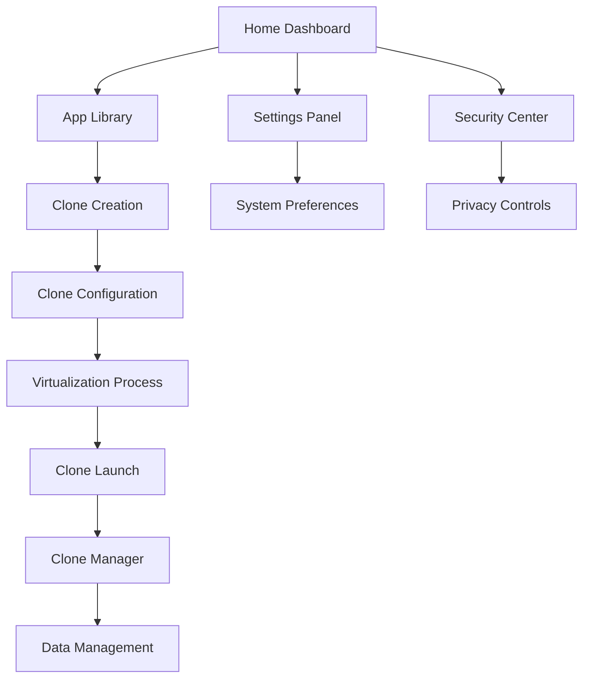

# Multi-Space App Cloner - Product Requirements Document

## 1. Product Overview

Multi-Space App Cloner হল একটি উন্নত Android অ্যাপ্লিকেশন যা ব্যবহারকারীদের একই ডিভাইসে একাধিক অ্যাপ ইনস্ট্যান্স চালানোর সুবিধা প্রদান করে। প্রতিটি ক্লোন করা অ্যাপের জন্য সম্পূর্ণ আলাদা ডেটা স্পেস এবং স্যান্ডবক্স পরিবেশ তৈরি করে।

এই অ্যাপটি সোশ্যাল মিডিয়া, গেমিং এবং বিজনেস অ্যাপের একাধিক অ্যাকাউন্ট পরিচালনার সমস্যা সমাধান করে। ব্যবহারকারীরা একই ডিভাইসে WhatsApp, Facebook, Instagram এর একাধিক অ্যাকাউন্ট ব্যবহার করতে পারবেন।

টার্গেট মার্কেট: Android ব্যবহারকারী যারা একাধিক সোশ্যাল মিডিয়া অ্যাকাউন্ট, গেমিং প্রোফাইল বা বিজনেস অ্যাপ পরিচালনা করেন।

## 2. Core Features

### 2.1 User Roles

| Role | Registration Method | Core Permissions |
|------|---------------------|------------------|
| Free User | Email/Phone registration | Basic app cloning (up to 3 apps), standard features |
| Premium User | In-app purchase upgrade | Unlimited app cloning, advanced customization, priority support |
| Admin | System level access | App management, user analytics, system configuration |

### 2.2 Feature Module

আমাদের Multi-Space App Cloner এর প্রধান পেজগুলো:

1. **Home Dashboard**: ক্লোন করা অ্যাপের গ্রিড ভিউ, quick access shortcuts, system status indicator
2. **App Library**: ইনস্টল করা অ্যাপের তালিকা, clone creation interface, app search and filter
3. **Clone Manager**: ক্লোন করা অ্যাপের সেটিংস, data management, clone customization
4. **Settings Panel**: system preferences, security options, storage management
5. **Security Center**: app lock configuration, privacy controls, permission management

### 2.3 Page Details

| Page Name | Module Name | Feature description |
|-----------|-------------|---------------------|
| Home Dashboard | Clone Grid View | Display cloned apps in organized grid layout with custom icons and names |
| Home Dashboard | Quick Actions | Launch cloned apps, create new clones, access recent activities |
| Home Dashboard | System Monitor | Show storage usage, memory consumption, active clone status |
| App Library | Installed Apps List | Browse all installed apps with search, filter, and categorization |
| App Library | Clone Creation | Select apps for cloning, configure clone settings, initiate cloning process |
| App Library | App Information | Display app details, permissions, storage usage, clone compatibility |
| Clone Manager | Clone Settings | Customize clone names, icons, notification settings, data isolation |
| Clone Manager | Data Management | Backup/restore clone data, clear cache, manage storage allocation |
| Clone Manager | Clone Control | Start/stop clones, uninstall clones, manage clone lifecycle |
| Settings Panel | System Preferences | Configure app behavior, theme selection, language settings |
| Settings Panel | Storage Management | Monitor disk usage, cleanup temporary files, optimize performance |
| Settings Panel | Advanced Options | Developer settings, debug mode, virtualization engine configuration |
| Security Center | App Lock | Set PIN/pattern/fingerprint protection for individual clones |
| Security Center | Privacy Controls | Manage app permissions, location spoofing, device ID modification |
| Security Center | Permission Manager | Control clone app permissions, restrict network access, sandbox configuration |

## 3. Core Process

### Main User Flow:

1. **App Discovery**: ব্যবহারকারী App Library থেকে clone করার জন্য অ্যাপ নির্বাচন করেন
2. **Clone Configuration**: Clone settings configure করেন (নাম, আইকন, security options)
3. **Virtualization Process**: System automatically creates isolated virtual environment
4. **Clone Launch**: Home Dashboard থেকে cloned app launch করেন
5. **Data Management**: Clone Manager দিয়ে data backup, settings modification করেন

### Admin Flow:

1. **System Monitoring**: Overall system performance এবং user analytics দেখেন
2. **Configuration Management**: Global settings এবং security policies configure করেন
3. **User Support**: User issues resolve করেন এবং system maintenance করেন

## 4. User Interface Design

### 4.1 Design Style

- **Primary Colors**: Deep Blue (#1E3A8A), Accent Green (#10B981)
- **Secondary Colors**: Light Gray (#F3F4F6), Dark Gray (#374151)
- **Button Style**: Rounded corners (8px radius), Material Design 3.0 elevation
- **Typography**: Roboto font family, 14sp body text, 18sp headings
- **Layout Style**: Card-based design with bottom navigation, floating action buttons
- **Icons**: Material Design icons with custom app clone indicators
- **Animations**: Smooth transitions (300ms), spring animations for interactions

### 4.2 Page Design Overview

| Page Name | Module Name | UI Elements |
|-----------|-------------|-------------|
| Home Dashboard | Clone Grid | 3x4 grid layout, custom app icons with clone badges, swipe gestures for quick actions |
| Home Dashboard | Navigation Bar | Bottom navigation with Home, Library, Manager, Settings tabs |
| Home Dashboard | Status Bar | System status indicators, storage usage progress bar, notification counter |
| App Library | App List | Vertical list with app icons, names, sizes, "Clone" action buttons |
| App Library | Search Bar | Material Design search input with real-time filtering |
| App Library | Category Tabs | Horizontal scrollable tabs for app categories (Social, Games, Productivity) |
| Clone Manager | Clone Cards | Expandable cards showing clone details, settings toggle switches |
| Clone Manager | Action Menu | Floating action menu with backup, restore, delete options |
| Settings Panel | Preference List | Grouped settings with toggle switches, sliders, dropdown menus |
| Security Center | Security Cards | Visual security status cards with lock icons and status indicators |

### 4.3 Responsiveness

অ্যাপটি mobile-first approach এ ডিজাইন করা হবে Android phones এবং tablets এর জন্য। Touch interaction optimization সহ gesture-based navigation support করবে। Adaptive layout যা বিভিন্ন screen sizes এ automatically adjust হবে।