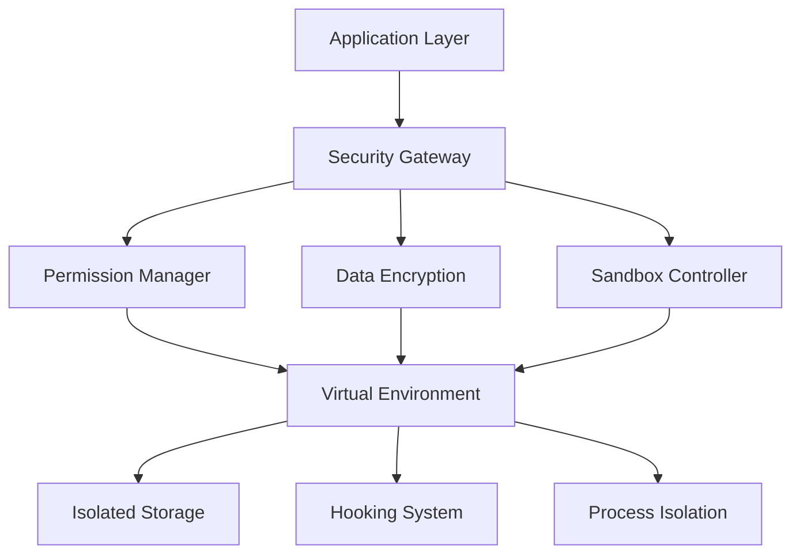

# Multi-Space App Cloner - Security & Privacy Guide

## 1. Security Architecture Overview

### Core Security Principles

* **Data Isolation**: প্রতিটি ক্লোন অ্যাপের ডেটা সম্পূর্ণ আলাদা এবং encrypted storage এ সংরক্ষিত

* **Sandbox Security**: Virtual environment এ strong isolation mechanisms

* **Permission Control**: Granular permission management for each clone

* **Anti-Tampering**: Root detection এবং code integrity verification

* **Secure Communication**: Encrypted data transfer between components

### Security Layers



## 2. Data Protection Mechanisms

### 2.1 Encryption Implementation

**Database Encryption:**

```java
public class SecureDatabase {
    private static final String ENCRYPTION_KEY = "your_32_byte_key_here";
    private SQLiteDatabase database;
    
    public SecureDatabase(Context context) {
        SQLiteDatabaseHook hook = new SQLiteDatabaseHook() {
            public void preKey(SQLiteDatabase database) {
                database.rawExecSQL("PRAGMA cipher_default_kdf_iter = 4000;");
            }
            
            public void postKey(SQLiteDatabase database) {
                database.rawExecSQL("PRAGMA cipher_memory_security = ON;");
            }
        };
        
        database = SQLiteDatabase.openOrCreateDatabase(
            getDatabasePath(context), 
            ENCRYPTION_KEY, 
            null, 
            hook
        );
    }
    
    public void insertCloneData(String cloneId, String data) {
        String encryptedData = AESUtil.encrypt(data, ENCRYPTION_KEY);
        ContentValues values = new ContentValues();
        values.put("clone_id", cloneId);
        values.put("encrypted_data", encryptedData);
        database.insert("clone_data", null, values);
    }
}
```

**File System Encryption:**

```java
public class SecureFileManager {
    private static final String AES_TRANSFORMATION = "AES/GCM/NoPadding";
    
    public static void writeEncryptedFile(String filePath, byte[] data, String key) {
        try {
            SecretKeySpec secretKey = new SecretKeySpec(key.getBytes(), "AES");
            Cipher cipher = Cipher.getInstance(AES_TRANSFORMATION);
            cipher.init(Cipher.ENCRYPT_MODE, secretKey);
            
            byte[] encryptedData = cipher.doFinal(data);
            byte[] iv = cipher.getIV();
            
            // Write IV + encrypted data
            FileOutputStream fos = new FileOutputStream(filePath);
            fos.write(iv.length);
            fos.write(iv);
            fos.write(encryptedData);
            fos.close();
        } catch (Exception e) {
            throw new SecurityException("File encryption failed", e);
        }
    }
    
    public static byte[] readEncryptedFile(String filePath, String key) {
        try {
            FileInputStream fis = new FileInputStream(filePath);
            
            // Read IV
            int ivLength = fis.read();
            byte[] iv = new byte[ivLength];
            fis.read(iv);
            
            // Read encrypted data
            byte[] encryptedData = fis.readAllBytes();
            fis.close();
            
            // Decrypt
            SecretKeySpec secretKey = new SecretKeySpec(key.getBytes(), "AES");
            Cipher cipher = Cipher.getInstance(AES_TRANSFORMATION);
            GCMParameterSpec gcmSpec = new GCMParameterSpec(128, iv);
            cipher.init(Cipher.DECRYPT_MODE, secretKey, gcmSpec);
            
            return cipher.doFinal(encryptedData);
        } catch (Exception e) {
            throw new SecurityException("File decryption failed", e);
        }
    }
}
```

### 2.2 Secure Storage Architecture

**Virtual Storage Structure:**

```
/data/data/com.multispace.cloner/
├── virtual_spaces/
│   ├── clone_001/
│   │   ├── data/           # Encrypted app data
│   │   ├── cache/          # Temporary files
│   │   ├── shared_prefs/   # Encrypted preferences
│   │   └── databases/      # Encrypted databases
│   ├── clone_002/
│   └── ...
├── system/
│   ├── clone_registry.db   # Encrypted clone metadata
│   ├── security_config.db  # Security settings
│   └── audit_logs.db       # Security audit logs
└── temp/
    └── secure_temp/        # Temporary encrypted files
```

## 3. Permission Management System

### 3.1 Permission Isolation

**Permission Controller:**

```java
public class PermissionController {
    private Map<String, Set<String>> clonePermissions;
    private SecurityConfig securityConfig;
    
    public boolean checkPermission(String cloneId, String permission) {
        // Check if clone has permission
        Set<String> permissions = clonePermissions.get(cloneId);
        if (permissions == null || !permissions.contains(permission)) {
            return false;
        }
        
        // Check security policy
        return securityConfig.isPermissionAllowed(cloneId, permission);
    }
    
    public void grantPermission(String cloneId, String permission) {
        // Validate permission request
        if (!isValidPermission(permission)) {
            throw new SecurityException("Invalid permission: " + permission);
        }
        
        // Add to clone permissions
        clonePermissions.computeIfAbsent(cloneId, k -> new HashSet<>()).add(permission);
        
        // Log permission grant
        auditLogger.logPermissionGrant(cloneId, permission);
    }
    
    public void revokePermission(String cloneId, String permission) {
        Set<String> permissions = clonePermissions.get(cloneId);
        if (permissions != null) {
            permissions.remove(permission);
            auditLogger.logPermissionRevoke(cloneId, permission);
        }
    }
}
```

### 3.2 Runtime Permission Enforcement

**Permission Hook Implementation:**

```java
public class PermissionHook {
    @HookMethod("android.content.ContextImpl.checkPermission")
    public static int checkPermissionHook(Context context, String permission, int pid, int uid) {
        String cloneId = VirtualCore.getInstance().getCurrentCloneId();
        
        if (cloneId != null) {
            PermissionController controller = SecurityManager.getPermissionController();
            boolean hasPermission = controller.checkPermission(cloneId, permission);
            
            return hasPermission ? PackageManager.PERMISSION_GRANTED : PackageManager.PERMISSION_DENIED;
        }
        
        // Call original method for non-virtual apps
        return (int) HookUtils.callOriginalMethod(context, permission, pid, uid);
    }
}
```

## 4. Anti-Tampering & Root Detection

### 4.1 Root Detection

**Root Detection Implementation:**

```java
public class RootDetection {
    private static final String[] ROOT_INDICATORS = {
        "/system/app/Superuser.apk",
        "/sbin/su",
        "/system/bin/su",
        "/system/xbin/su",
        "/data/local/xbin/su",
        "/data/local/bin/su",
        "/system/sd/xbin/su",
        "/system/bin/failsafe/su",
        "/data/local/su"
    };
    
    public static boolean isDeviceRooted() {
        return checkRootFiles() || checkRootPackages() || checkSuCommand();
    }
    
    private static boolean checkRootFiles() {
        for (String path : ROOT_INDICATORS) {
            if (new File(path).exists()) {
                return true;
            }
        }
        return false;
    }
    
    private static boolean checkRootPackages() {
        String[] rootPackages = {
            "com.noshufou.android.su",
            "com.thirdparty.superuser",
            "eu.chainfire.supersu",
            "com.koushikdutta.superuser"
        };
        
        PackageManager pm = context.getPackageManager();
        for (String packageName : rootPackages) {
            try {
                pm.getPackageInfo(packageName, 0);
                return true;
            } catch (PackageManager.NameNotFoundException e) {
                // Package not found, continue
            }
        }
        return false;
    }
    
    private static boolean checkSuCommand() {
        try {
            Process process = Runtime.getRuntime().exec("su");
            return true;
        } catch (Exception e) {
            return false;
        }
    }
}
```

### 4.2 Code Integrity Verification

**Integrity Checker:**

```java
public class IntegrityChecker {
    private static final String EXPECTED_SIGNATURE = "your_app_signature_hash";
    
    public static boolean verifyAppIntegrity(Context context) {
        return verifySignature(context) && verifyChecksum(context);
    }
    
    private static boolean verifySignature(Context context) {
        try {
            PackageInfo packageInfo = context.getPackageManager()
                .getPackageInfo(context.getPackageName(), PackageManager.GET_SIGNATURES);
            
            for (Signature signature : packageInfo.signatures) {
                String signatureHash = sha256(signature.toByteArray());
                if (EXPECTED_SIGNATURE.equals(signatureHash)) {
                    return true;
                }
            }
            return false;
        } catch (Exception e) {
            return false;
        }
    }
    
    private static boolean verifyChecksum(Context context) {
        try {
            String apkPath = context.getPackageCodePath();
            String actualChecksum = calculateFileChecksum(apkPath);
            String expectedChecksum = getExpectedChecksum();
            
            return expectedChecksum.equals(actualChecksum);
        } catch (Exception e) {
            return false;
        }
    }
}
```

## 5. Network Security

### 5.1 Network Isolation

**Network Hook Implementation:**

```java
public class NetworkHook {
    @HookMethod("java.net.Socket.connect")
    public static void socketConnectHook(Socket socket, SocketAddress endpoint, int timeout) {
        String cloneId = VirtualCore.getInstance().getCurrentCloneId();
        
        if (cloneId != null) {
            NetworkPolicy policy = SecurityManager.getNetworkPolicy(cloneId);
            
            if (!policy.isNetworkAllowed()) {
                throw new SecurityException("Network access denied for clone: " + cloneId);
            }
            
            if (policy.hasProxyConfig()) {
                // Redirect through proxy
                endpoint = policy.getProxyEndpoint(endpoint);
            }
            
            // Log network access
            auditLogger.logNetworkAccess(cloneId, endpoint.toString());
        }
        
        // Call original method
        HookUtils.callOriginalMethod(socket, endpoint, timeout);
    }
}
```

### 5.2 SSL Pinning

**Certificate Pinning:**

```java
public class SSLPinning {
    private static final String[] PINNED_CERTIFICATES = {
        "sha256/your_certificate_hash_1",
        "sha256/your_certificate_hash_2"
    };
    
    public static OkHttpClient createSecureClient() {
        CertificatePinner certificatePinner = new CertificatePinner.Builder()
            .add("api.yourapp.com", PINNED_CERTIFICATES)
            .build();
            
        return new OkHttpClient.Builder()
            .certificatePinner(certificatePinner)
            .build();
    }
}
```

## 6. Privacy Protection

### 6.1 Device Information Spoofing

**Device Info Hook:**

```java
public class DeviceInfoHook {
    @HookMethod("android.telephony.TelephonyManager.getDeviceId")
    public static String getDeviceIdHook(TelephonyManager tm) {
        String cloneId = VirtualCore.getInstance().getCurrentCloneId();
        
        if (cloneId != null) {
            DeviceConfig config = SecurityManager.getDeviceConfig(cloneId);
            if (config.hasCustomDeviceId()) {
                return config.getCustomDeviceId();
            }
        }
        
        return (String) HookUtils.callOriginalMethod(tm);
    }
    
    @HookMethod("android.provider.Settings.Secure.getString")
    public static String getSecureSettingHook(ContentResolver resolver, String name) {
        String cloneId = VirtualCore.getInstance().getCurrentCloneId();
        
        if (cloneId != null && Settings.Secure.ANDROID_ID.equals(name)) {
            DeviceConfig config = SecurityManager.getDeviceConfig(cloneId);
            if (config.hasCustomAndroidId()) {
                return config.getCustomAndroidId();
            }
        }
        
        return (String) HookUtils.callOriginalMethod(resolver, name);
    }
}
```

### 6.2 Location Privacy

**Location Spoofing:**

```java
public class LocationHook {
    @HookMethod("android.location.LocationManager.getLastKnownLocation")
    public static Location getLastKnownLocationHook(LocationManager lm, String provider) {
        String cloneId = VirtualCore.getInstance().getCurrentCloneId();
        
        if (cloneId != null) {
            LocationConfig config = SecurityManager.getLocationConfig(cloneId);
            if (config.hasCustomLocation()) {
                return config.getCustomLocation();
            }
            
            if (config.isLocationBlocked()) {
                return null;
            }
        }
        
        return (Location) HookUtils.callOriginalMethod(lm, provider);
    }
}
```

## 7. Audit & Monitoring

### 7.1 Security Audit Logging

**Audit Logger:**

```java
public class SecurityAuditLogger {
    private SQLiteDatabase auditDb;
    
    public void logSecurityEvent(String cloneId, String eventType, String details) {
        ContentValues values = new ContentValues();
        values.put("clone_id", cloneId);
        values.put("event_type", eventType);
        values.put("details", details);
        values.put("timestamp", System.currentTimeMillis());
        values.put("severity", getSeverityLevel(eventType));
        
        auditDb.insert("security_audit", null, values);
        
        // Alert on high severity events
        if (getSeverityLevel(eventType) >= SEVERITY_HIGH) {
            triggerSecurityAlert(cloneId, eventType, details);
        }
    }
    
    public List<SecurityEvent> getAuditLogs(String cloneId, long fromTime, long toTime) {
        String selection = "clone_id = ? AND timestamp BETWEEN ? AND ?";
        String[] selectionArgs = {cloneId, String.valueOf(fromTime), String.valueOf(toTime)};
        
        Cursor cursor = auditDb.query("security_audit", null, selection, selectionArgs, 
                                    null, null, "timestamp DESC");
        
        List<SecurityEvent> events = new ArrayList<>();
        while (cursor.moveToNext()) {
            events.add(SecurityEvent.fromCursor(cursor));
        }
        cursor.close();
        
        return events;
    }
}
```

### 7.2 Real-time Monitoring

**Security Monitor:**

```java
public class SecurityMonitor {
    private static final int MAX_FAILED_ATTEMPTS = 3;
    private Map<String, Integer> failedAttempts;
    
    public void monitorCloneAccess(String cloneId, boolean success) {
        if (success) {
            failedAttempts.remove(cloneId);
        } else {
            int attempts = failedAttempts.getOrDefault(cloneId, 0) + 1;
            failedAttempts.put(cloneId, attempts);
            
            if (attempts >= MAX_FAILED_ATTEMPTS) {
                // Lock clone temporarily
                SecurityManager.lockClone(cloneId, LOCK_DURATION_MINUTES);
                
                // Send security alert
                SecurityAlert alert = new SecurityAlert(
                    cloneId, 
                    "Multiple failed access attempts", 
                    SecurityAlert.SEVERITY_HIGH
                );
                SecurityManager.sendAlert(alert);
            }
        }
    }
}
```

## 8. Compliance & Best Practices

### 8.1 Data Protection Compliance

* **GDPR Compliance**: User data encryption, right to deletion, data portability

* **CCPA Compliance**: Privacy controls, data access transparency

* **Local Privacy Laws**: Adherence to regional privacy regulations

### 8.2 Security Best Practices

* Regular security audits and penetration testing

* Secure coding practices and code reviews

* Dependency vulnerability scanning

* Incident response procedures

* User security education and awareness

### 8.3 Privacy by Design

* Minimal data collection principles

* Purpose limitation for data usage

* Data retention policies

* User consent mechanisms

* Transparent privacy

