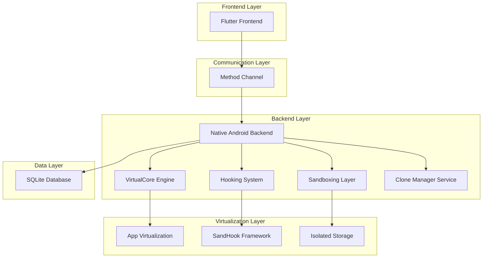
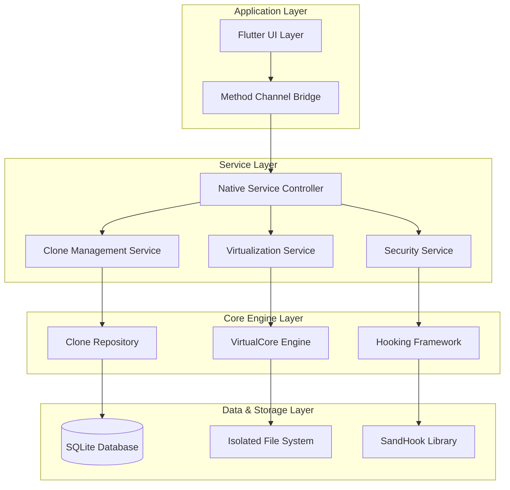
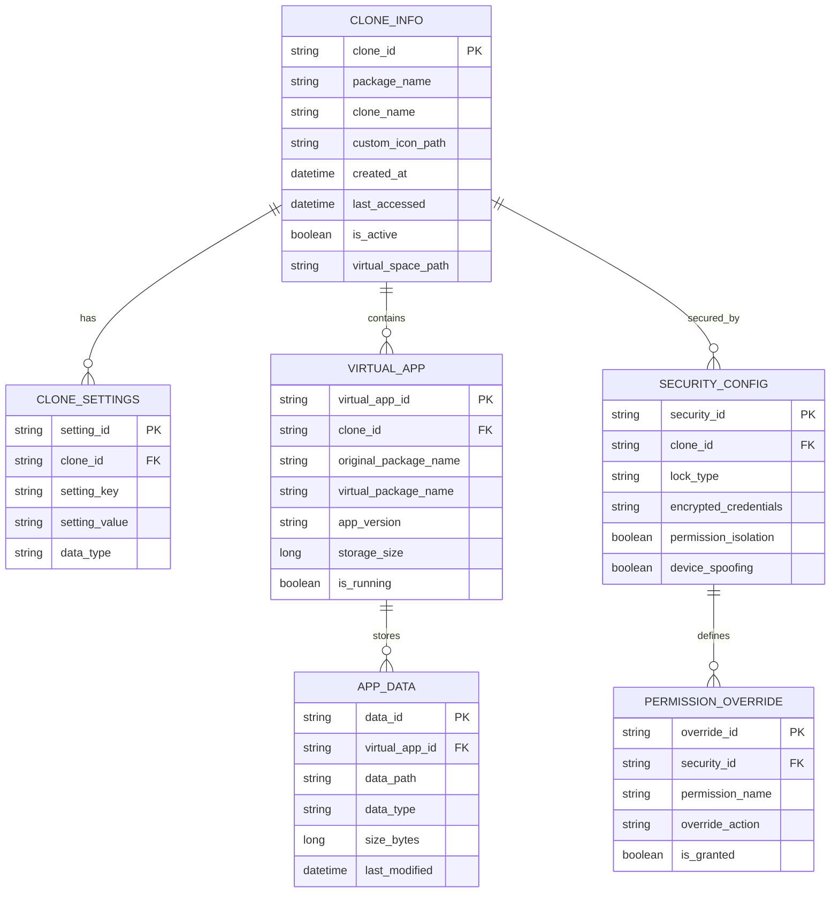

# Multi-Space App Cloner - Technical Architecture Document

## 1. Architecture Design



## 2. Technology Description

* **Frontend**: Flutter\@3.16 + Material Design 3 + Provider state management

* **Backend**: Native Android (Java/Kotlin) + VirtualCore framework

* **Virtualization**: Custom VirtualCore engine + SandHook hooking system

* **Database**: SQLite for clone metadata + SharedPreferences for settings

* **Communication**: Flutter MethodChannel for native integration

* **Security**: Custom sandboxing + permission isolation + data encryption

## 3. Route Definitions

| Route                      | Purpose                                                      |
| -------------------------- | ------------------------------------------------------------ |
| /home                      | Main dashboard displaying cloned apps grid and system status |
| /library                   | App library for browsing installed apps and creating clones  |
| /manager                   | Clone management interface for settings and data control     |
| /settings                  | System preferences and configuration options                 |
| /security                  | Security center for app locks and privacy controls           |
| /clone-detail/:id          | Individual clone configuration and management                |
| /create-clone/:packageName | Clone creation wizard with customization options             |

## 4. API Definitions

### 4.1 Core Native APIs

**App Cloning Service**

```
MethodChannel: com.multispace.cloner/app_service
```

Create Clone:

| Method Name  | Parameters                                                 | Return Type              | Description                                          |
| ------------ | ---------------------------------------------------------- | ------------------------ | ---------------------------------------------------- |
| createClone  | packageName: String, cloneName: String, customIcon: String | Future<bool>             | Creates a new app clone with specified configuration |
| deleteClone  | cloneId: String                                            | Future<bool>             | Removes an existing clone and its data               |
| launchClone  | cloneId: String                                            | Future<bool>             | Launches the specified cloned app                    |
| getCloneList | -                                                          | Future\<List<CloneInfo>> | Returns list of all created clones                   |

**Virtualization Engine**

```
MethodChannel: com.multispace.cloner/virtual_engine
```

Virtual Environment Management:

| Method Name            | Parameters                       | Return Type     | Description                              |
| ---------------------- | -------------------------------- | --------------- | ---------------------------------------- |
| initializeVirtualSpace | cloneId: String                  | Future<bool>    | Initializes isolated virtual environment |
| installAppInVirtual    | apkPath: String, cloneId: String | Future<bool>    | Installs app in virtual space            |
| getVirtualAppInfo      | cloneId: String                  | Future<AppInfo> | Retrieves virtual app information        |
| cleanVirtualSpace      | cloneId: String                  | Future<bool>    | Cleans virtual environment data          |

**Security & Hooking**

```
MethodChannel: com.multispace.cloner/security
```

Security Controls:

| Method Name        | Parameters                                             | Return Type  | Description                           |
| ------------------ | ------------------------------------------------------ | ------------ | ------------------------------------- |
| setAppLock         | cloneId: String, lockType: String, credentials: String | Future<bool> | Sets security lock for clone          |
| hookSystemCalls    | cloneId: String, hookConfig: Map                       | Future<bool> | Configures system call hooking        |
| isolatePermissions | cloneId: String, permissions: List<String>             | Future<bool> | Isolates app permissions              |
| spoofDeviceInfo    | cloneId: String, deviceInfo: Map                       | Future<bool> | Modifies device information for clone |

Example Request:

```json
{
  "method": "createClone",
  "arguments": {
    "packageName": "com.whatsapp",
    "cloneName": "WhatsApp Business",
    "customIcon": "/storage/icons/whatsapp_business.png"
  }
}
```

Example Response:

```json
{
  "success": true,
  "cloneId": "clone_whatsapp_001",
  "message": "Clone created successfully"
}
```

## 5. Server Architecture Diagram



## 6. Data Model

### 6.1 Data Model Definition



### 6.2 Data Definition Language

**Clone Information Table (clone\_info)**

```sql
-- Create clone_info table
CREATE TABLE clone_info (
    clone_id TEXT PRIMARY KEY,
    package_name TEXT NOT NULL,
    clone_name TEXT NOT NULL,
    custom_icon_path TEXT,
    created_at INTEGER DEFAULT (strftime('%s', 'now')),
    last_accessed INTEGER DEFAULT (strftime('%s', 'now')),
    is_active INTEGER DEFAULT 1,
    virtual_space_path TEXT NOT NULL,
    storage_quota INTEGER DEFAULT 1073741824 -- 1GB default
);

-- Create indexes
CREATE INDEX idx_clone_package_name ON clone_info(package_name);
CREATE INDEX idx_clone_created_at ON clone_info(created_at DESC);
CREATE INDEX idx_clone_active ON clone_info(is_active);
```

**Clone Settings Table (clone\_settings)**

```sql
-- Create clone_settings table
CREATE TABLE clone_settings (
    setting_id TEXT PRIMARY KEY,
    clone_id TEXT NOT NULL,
    setting_key TEXT NOT NULL,
    setting_value TEXT,
    data_type TEXT DEFAULT 'string',
    FOREIGN KEY (clone_id) REFERENCES clone_info(clone_id) ON DELETE CASCADE
);

-- Create indexes
CREATE INDEX idx_settings_clone_id ON clone_settings(clone_id);
CREATE INDEX idx_settings_key ON clone_settings(setting_key);
CREATE UNIQUE INDEX idx_settings_clone_key ON clone_settings(clone_id, setting_key);
```

**Virtual App Table (virtual\_app)**

```sql
-- Create virtual_app table
CREATE TABLE virtual_app (
    virtual_app_id TEXT PRIMARY KEY,
    clone_id TEXT NOT NULL,
    original_package_name TEXT NOT NULL,
    virtual_package_name TEXT NOT NULL,
    app_version TEXT,
    storage_size INTEGER DEFAULT 0,
    is_running INTEGER DEFAULT 0,
    install_time INTEGER DEFAULT (strftime('%s', 'now')),
    FOREIGN KEY (clone_id) REFERENCES clone_info(clone_id) ON DELETE CASCADE
);

-- Create indexes
CREATE INDEX idx_virtual_app_clone_id ON virtual_app(clone_id);
CREATE INDEX idx_virtual_app_package ON virtual_app(original_package_name);
CREATE INDEX idx_virtual_app_running ON virtual_app(is_running);
```

**Security Configuration Table (security\_config)**

```sql
-- Create security_config table
CREATE TABLE security_config (
    security_id TEXT PRIMARY KEY,
    clone_id TEXT NOT NULL,
    lock_type TEXT DEFAULT 'none', -- none, pin, pattern, fingerprint
    encrypted_credentials TEXT,
    permission_isolation INTEGER DEFAULT 1,
    device_spoofing INTEGER DEFAULT 0,
    network_isolation INTEGER DEFAULT 0,
    FOREIGN KEY (clone_id) REFERENCES clone_info(clone_id) ON DELETE CASCADE
);

-- Create indexes
CREATE INDEX idx_security_clone_id ON security_config(clone_id);
CREATE INDEX idx_security_lock_type ON security_config(lock_type);
```

**Permission Override Table (permission\_override)**

```sql
-- Create permission_override table
CREATE TABLE permission_override (
    override_id TEXT PRIMARY KEY,
    security_id TEXT NOT NULL,
    permission_name TEXT NOT NULL,
    override_action TEXT DEFAULT 'default', -- default, grant, deny, ask
    is_granted INTEGER DEFAULT 0,
    FOREIGN KEY (security_id) REFERENCES security_config(security_id) ON DELETE CASCADE
);

-- Create indexes
CREATE INDEX idx_permission_security_id ON permission_override(security_id);
CREATE INDEX idx_permission_name ON permission_override(permission_name);
CREATE UNIQUE INDEX idx_permission_security_name ON permission_override(security_id, permission_name);
```

**Initial Data**

```sql
-- Insert default system settings
INSERT INTO clone_info (clone_id, package_name, clone_name, virtual_space_path) VALUES
('system_default', 'com.multispace.cloner', 'System Default', '/data/data/com.multispace.cloner/virtual_spaces/system');

-- Insert default security configuration
INSERT INTO security_config (security_id, clone_id, lock_type, permission_isolation) VALUES
('security_system_default', 'system_default', 'none', 1);
```

