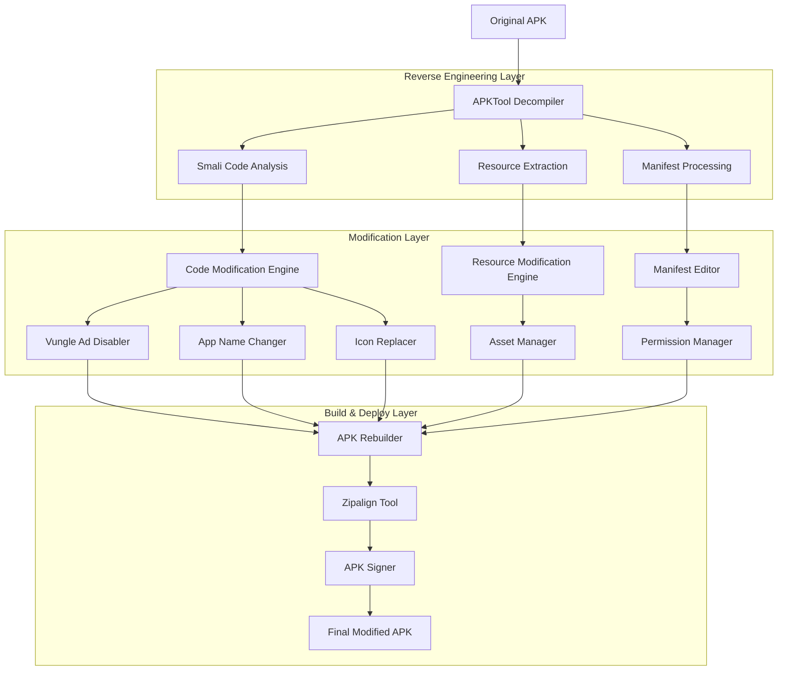
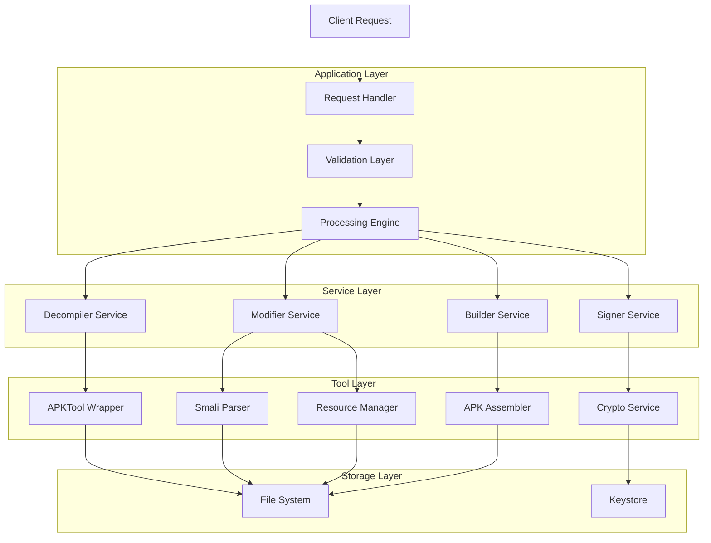
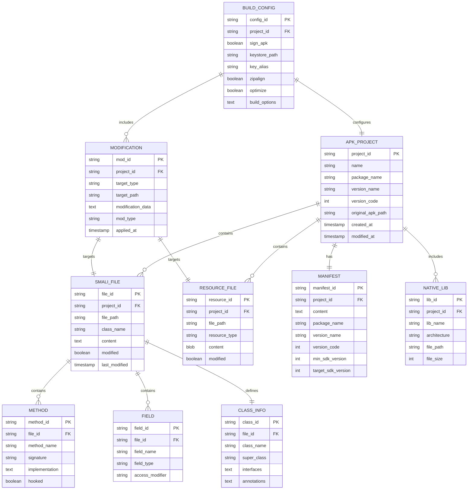
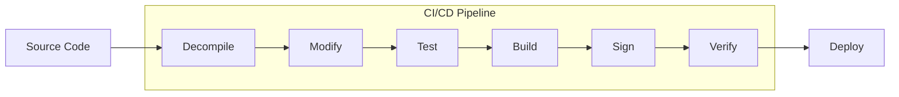

# DWH Crush APK - টেকনিক্যাল আর্কিটেকচার ডকুমেন্ট

## 1. Architecture Design



## 2. Technology Description

### Core Technologies:

* **Reverse Engineering**: APKTool v2.4.0+ (Smali/Baksmali)

* **Code Analysis**: Smali Assembly Language

* **Resource Management**: AAPT (Android Asset Packaging Tool)

* **Build System**: Custom Shell Scripts + APKTool

* **Signing**: Java Keytool + Jarsigner

* **Optimization**: Zipalign + ProGuard concepts

### Development Stack:

* **Primary Language**: Smali (Dalvik Assembly)

* **Native Libraries**: C/C++ (JNI)

* **Resource Format**: Android Binary XML

* **Packaging**: APK (Android Package)

* **Signing**: PKCS#7 Digital Signatures

### Key Dependencies:

* APKTool (Decompilation/Recompilation)

* Java JDK 8+ (Signing tools)

* Android SDK Build Tools

* Zipalign (APK optimization)

* AAPT (Resource processing)

## 3. Route Definitions

| Component    | Purpose                   | Input               | Output                 |
| ------------ | ------------------------- | ------------------- | ---------------------- |
| `/decompile` | APK decompilation process | Original APK file   | Smali code + Resources |
| `/analyze`   | Code structure analysis   | Decompiled files    | Component mapping      |
| `/modify`    | Code modification engine  | Target changes      | Modified Smali code    |
| `/resource`  | Resource modification     | Asset files         | Updated resources      |
| `/build`     | APK reconstruction        | Modified components | Unsigned APK           |
| `/sign`      | APK signing process       | Unsigned APK        | Signed APK             |
| `/deploy`    | Final deployment          | Signed APK          | Installable APK        |

## 4. API Definitions

### 4.1 Core Modification APIs

#### Vungle Ad Disabling

```smali
# Target: com/vungle/warren/AdLoader.smali
.method public canPlayAd()Z
    .locals 1
    const/4 v0, 0x0  # Return false
    return v0
.end method

.method public loadAd()V
    .locals 0
    # No-op implementation
    return-void
.end method

.method public playAd()V
    .locals 0
    # No-op implementation
    return-void
.end method
```

#### App Name Modification

```xml
<!-- res/values/strings.xml -->
<resources>
    <string name="app_name">ゆめ</string>
    <string name="application_name">ゆめ</string>
</resources>
```

#### Icon Replacement

```bash
# Resource replacement process
cp new_icon.png res/mipmap-xxxhdpi/ic_launcher.png
cp new_icon.png res/mipmap-xxhdpi/ic_launcher.png
cp new_icon.png res/mipmap-xhdpi/ic_launcher.png
cp new_icon.png res/mipmap-hdpi/ic_launcher.png
cp new_icon.png res/mipmap-mdpi/ic_launcher.png
```

### 4.2 Build Process APIs

#### Decompilation API

```bash
POST /api/decompile
```

Request:

| Param Name     | Param Type | isRequired | Description                           |
| -------------- | ---------- | ---------- | ------------------------------------- |
| apk\_path      | string     | true       | Path to original APK file             |
| output\_dir    | string     | true       | Output directory for decompiled files |
| framework\_dir | string     | false      | Custom framework directory            |

Response:

| Param Name   | Param Type | Description                   |
| ------------ | ---------- | ----------------------------- |
| status       | boolean    | Decompilation success status  |
| smali\_files | array      | List of generated Smali files |
| resources    | object     | Resource file mapping         |
| manifest     | string     | AndroidManifest.xml path      |

#### Modification API

```bash
POST /api/modify
```

Request:

| Param Name    | Param Type | isRequired | Description                       |
| ------------- | ---------- | ---------- | --------------------------------- |
| target\_files | array      | true       | Files to be modified              |
| modifications | object     | true       | Modification instructions         |
| backup        | boolean    | false      | Create backup before modification |

Response:

| Param Name      | Param Type | Description                 |
| --------------- | ---------- | --------------------------- |
| status          | boolean    | Modification success status |
| modified\_files | array      | List of modified files      |
| errors          | array      | Any errors encountered      |

#### Build API

```bash
POST /api/build
```

Request:

| Param Name  | Param Type | isRequired | Description                   |
| ----------- | ---------- | ---------- | ----------------------------- |
| source\_dir | string     | true       | Directory with modified files |
| output\_apk | string     | true       | Output APK file path          |
| sign        | boolean    | false      | Auto-sign the APK             |

Response:

| Param Name | Param Type | Description            |
| ---------- | ---------- | ---------------------- |
| status     | boolean    | Build success status   |
| apk\_path  | string     | Path to generated APK  |
| size       | integer    | APK file size in bytes |
| signature  | string     | APK signature hash     |

## 5. Server Architecture Diagram



## 6. Data Model

### 6.1 Data Model Definition



### 6.2 Data Definition Language

#### APK Project Table

```sql
-- Create APK projects table
CREATE TABLE apk_projects (
    project_id VARCHAR(36) PRIMARY KEY DEFAULT (UUID()),
    name VARCHAR(255) NOT NULL,
    package_name VARCHAR(255) NOT NULL,
    version_name VARCHAR(50) NOT NULL,
    version_code INTEGER NOT NULL,
    original_apk_path TEXT NOT NULL,
    created_at TIMESTAMP DEFAULT CURRENT_TIMESTAMP,
    modified_at TIMESTAMP DEFAULT CURRENT_TIMESTAMP ON UPDATE CURRENT_TIMESTAMP
);

-- Create indexes
CREATE INDEX idx_apk_projects_package ON apk_projects(package_name);
CREATE INDEX idx_apk_projects_created ON apk_projects(created_at DESC);
```

#### Smali Files Table

```sql
-- Create Smali files table
CREATE TABLE smali_files (
    file_id VARCHAR(36) PRIMARY KEY DEFAULT (UUID()),
    project_id VARCHAR(36) NOT NULL,
    file_path TEXT NOT NULL,
    class_name VARCHAR(500) NOT NULL,
    content LONGTEXT,
    modified BOOLEAN DEFAULT FALSE,
    last_modified TIMESTAMP DEFAULT CURRENT_TIMESTAMP ON UPDATE CURRENT_TIMESTAMP,
    FOREIGN KEY (project_id) REFERENCES apk_projects(project_id) ON DELETE CASCADE
);

-- Create indexes
CREATE INDEX idx_smali_files_project ON smali_files(project_id);
CREATE INDEX idx_smali_files_class ON smali_files(class_name);
CREATE INDEX idx_smali_files_modified ON smali_files(modified, last_modified DESC);
```

#### Resource Files Table

```sql
-- Create resource files table
CREATE TABLE resource_files (
    resource_id VARCHAR(36) PRIMARY KEY DEFAULT (UUID()),
    project_id VARCHAR(36) NOT NULL,
    file_path TEXT NOT NULL,
    resource_type VARCHAR(50) NOT NULL,
    content LONGBLOB,
    modified BOOLEAN DEFAULT FALSE,
    FOREIGN KEY (project_id) REFERENCES apk_projects(project_id) ON DELETE CASCADE
);

-- Create indexes
CREATE INDEX idx_resource_files_project ON resource_files(project_id);
CREATE INDEX idx_resource_files_type ON resource_files(resource_type);
```

#### Modifications Table

```sql
-- Create modifications table
CREATE TABLE modifications (
    mod_id VARCHAR(36) PRIMARY KEY DEFAULT (UUID()),
    project_id VARCHAR(36) NOT NULL,
    target_type ENUM('smali', 'resource', 'manifest') NOT NULL,
    target_path TEXT NOT NULL,
    modification_data LONGTEXT NOT NULL,
    mod_type VARCHAR(100) NOT NULL,
    applied_at TIMESTAMP DEFAULT CURRENT_TIMESTAMP,
    FOREIGN KEY (project_id) REFERENCES apk_projects(project_id) ON DELETE CASCADE
);

-- Create indexes
CREATE INDEX idx_modifications_project ON modifications(project_id);
CREATE INDEX idx_modifications_type ON modifications(mod_type);
CREATE INDEX idx_modifications_applied ON modifications(applied_at DESC);
```

#### Build Configuration Table

```sql
-- Create build configuration table
CREATE TABLE build_configs (
    config_id VARCHAR(36) PRIMARY KEY DEFAULT (UUID()),
    project_id VARCHAR(36) NOT NULL UNIQUE,
    sign_apk BOOLEAN DEFAULT TRUE,
    keystore_path TEXT,
    key_alias VARCHAR(255),
    zipalign BOOLEAN DEFAULT TRUE,
    optimize BOOLEAN DEFAULT FALSE,
    build_options JSON,
    FOREIGN KEY (project_id) REFERENCES apk_projects(project_id) ON DELETE CASCADE
);
```

#### Initial Data

```sql
-- Insert sample project
INSERT INTO apk_projects (name, package_name, version_name, version_code, original_apk_path)
VALUES ('DWH Crush APK', 'com.dualspace.multispace.androil', '1.1.3', 12, '/path/to/DWH™~ 08-1.1.3_src.apk');

-- Insert sample modifications
INSERT INTO modifications (project_id, target_type, target_path, modification_data, mod_type)
VALUES 
    ((SELECT project_id FROM apk_projects WHERE name = 'DWH Crush APK'), 
     'smali', 'com/vungle/warren/AdLoader.smali', 
     'canPlayAd()Z method modified to return false', 'ad_disable'),
    ((SELECT project_id FROM apk_projects WHERE name = 'DWH Crush APK'), 
     'resource', 'res/values/strings.xml', 
     'app_name changed to ゆめ', 'name_change'),
    ((SELECT project_id FROM apk_projects WHERE name = 'DWH Crush APK'), 
     'resource', 'res/mipmap-xxxhdpi/ic_launcher.png', 
     'Icon replaced with custom icon', 'icon_change');

-- Insert build configuration
INSERT INTO build_configs (project_id, sign_apk, keystore_path, key_alias, zipalign, optimize)
VALUES 
    ((SELECT project_id FROM apk_projects WHERE name = 'DWH Crush APK'), 
     TRUE, '/path/to/debug.keystore', 'androiddebugkey', TRUE, FALSE);
```

## 7. Security Considerations

### 7.1 Code Obfuscation

* Class name mangling

* Method signature obfuscation

* String encryption

* Control flow obfuscation

### 7.2 Anti-Reverse Engineering

* Dynamic code loading

* Native code protection

* Anti-debugging techniques

* Integrity checks

### 7.3 Signing Security

* Strong keystore passwords

* Key rotation strategies

* Certificate pinning

* Signature verification

## 8. Performance Optimization

### 8.1 Build Performance

* Parallel processing

* Incremental builds

* Caching strategies

* Resource optimization

### 8.2 Runtime Performance

* DEX optimization

* Native library optimization

* Memory management

* CPU usage optimization

## 9. Deployment Pipeline



### 9.1 Automated Testing

* APK integrity checks

* Installation testing

* Functional testing

* Performance testing

### 9.2 Quality Assurance

* Code review

* Security scanning

* Compatibility testing

* User acceptance testing

***

**Document Version**: 1.0\
**Last Updated**: January 2025\
**Architecture Team**: DWH Development Team

> **Note**: This document describes the technical architecture for educational and research purposes only. Ensure compliance with applicable laws and regulations when implementing these techniques.

